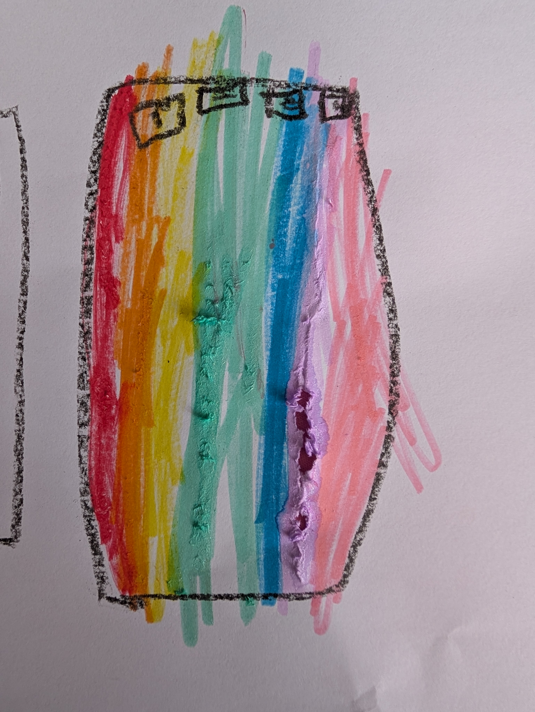
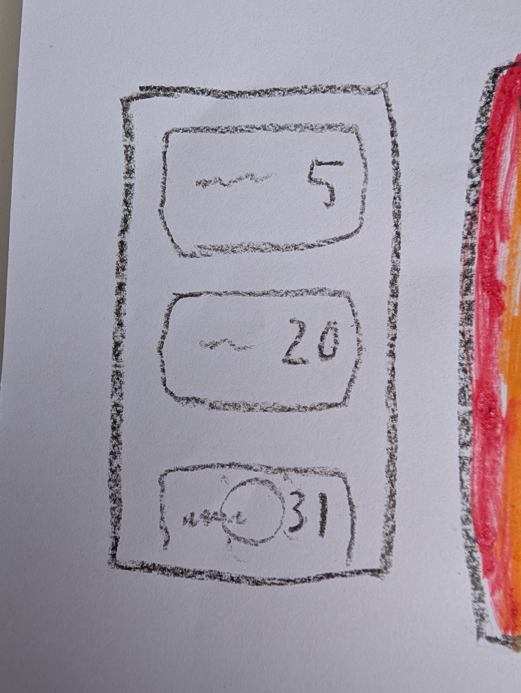

# Penelope's Special Days

A fun countdown app that Penelope (5) and Dad built together to track the days until birthdays, holidays, and other special events throughout the year.

## What it does

Every day of the year gets a numbered chip. Special days like birthdays and holidays get big illustrated cards with animated videos you can play by tapping them. Penelope can pick a color from the rainbow selector at the top and tick off each day as it passes, filling the screen with color as the year goes on.

## Features

- Rainbow glitter animated background (Penelope's design choice)
- 18 special events with AI-generated kawaii cartoon illustrations and animated videos
- 7 color picker to tick off days in your favorite color
- Gold shimmering border on days ready to be ticked
- Day numbers relative to today (negative = past, 0 = today, positive = future)
- Tap a special event card to play its looping animated video
- Tap the countdown circle to tick/untick a day
- Scrolls from January 1st to December 31st, resets each year
- All ticks persist locally between app sessions

## Special Events

| Event | Date | Image |
|-------|------|-------|
| New Year's Day | Jan 1 | Party hat |
| Caspian's Birthday | Jan 4 | Toy cars |
| Valentine's Day | Feb 14 | Love heart |
| Alfie's Birthday | Feb 20 | Fast car |
| Mum's Birthday | Mar 7 | Lady at the beach |
| Charlie's Birthday | Mar 17 | Girl dancing |
| Easter | Varies | Cross with flowers |
| Dad's Birthday | May 26 | Video game controller |
| Penelope's Birthday | May 28 | Disco ball |
| Opa's Birthday | Jun 11 | Old man sleeping |
| Jordan's Birthday | Jul 20 | Baby napping |
| Nanny's Birthday | Aug 29 | Grandma cooking custard |
| Sia's Birthday | Sep 7 | Kids playing |
| Malee's Birthday | Sep 29 | Coffee cup |
| Dave's Birthday | Oct 17 | Ice cream |
| Natalie's Birthday | Nov 12 | Girl on a road bike |
| Christmas | Dec 25 | Baby Jesus in a manger |
| New Year's Eve | Dec 31 | Fireworks |

## How it was made

- The app wireframes were drawn by Penelope with crayons and paint
- All cartoon images were generated using [Ideogram v3 Turbo](https://replicate.com/ideogram-ai/ideogram-v3-turbo) via the Replicate API
- All animated videos were generated using [Wan 2.2 I2V Fast](https://replicate.com/wan-video/wan-2.2-i2v-fast) via the Replicate API
- Built with Flutter, targeting Android

## Building

```bash
flutter pub get
flutter build apk --debug
```

## Screenshots

The original wireframes drawn by Penelope:

| Main screen design | Special event cards |
|---|---|
|  |  |
